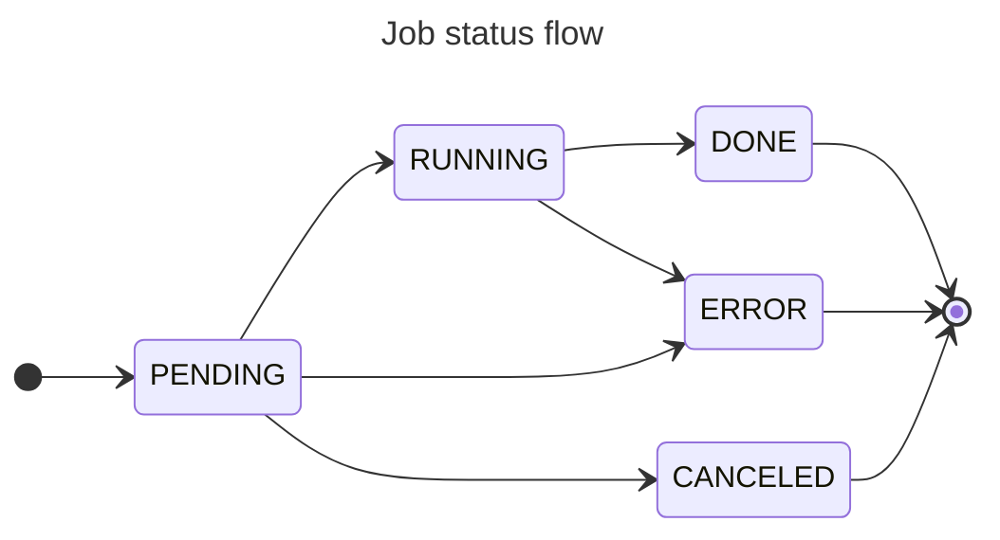
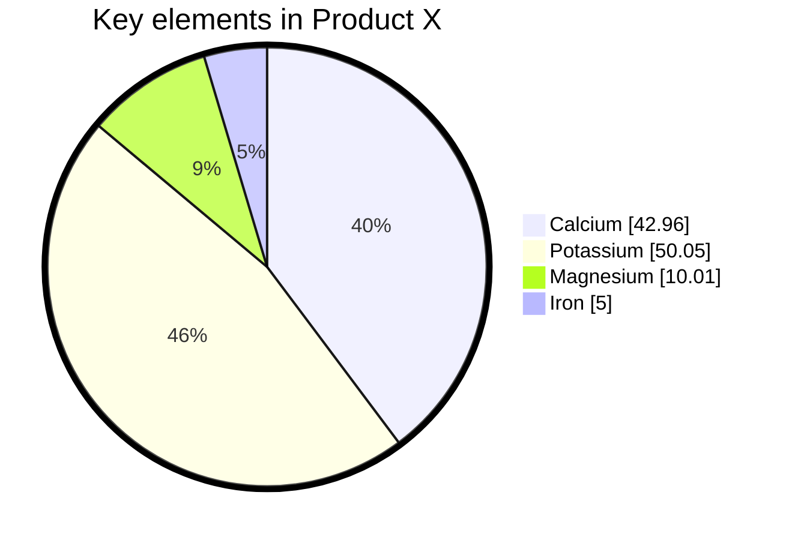
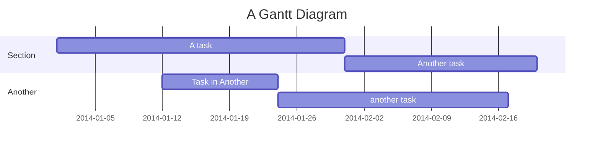

This page showcases different Mermaid diagram types to show how they render. See [Mermaid documentation](https://mermaid.js.org) for full reference.

## A flow chart with title

## A pie chart with tweaked style

## A Gantt diagram

