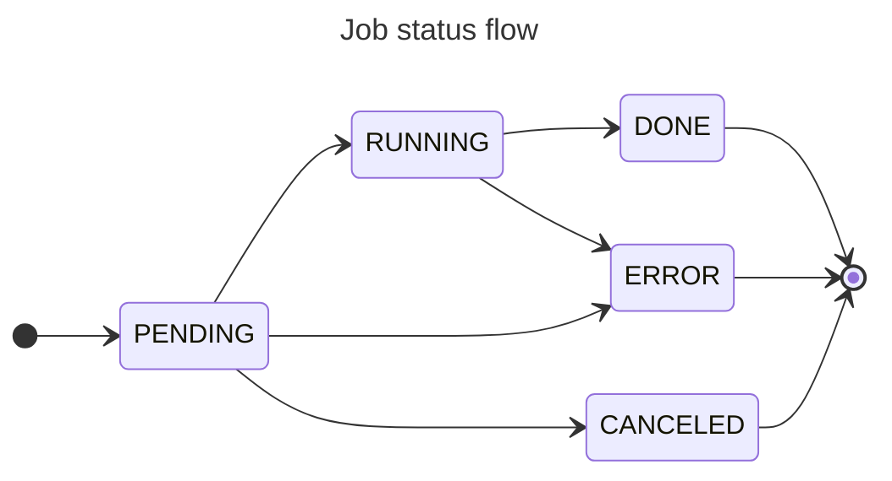
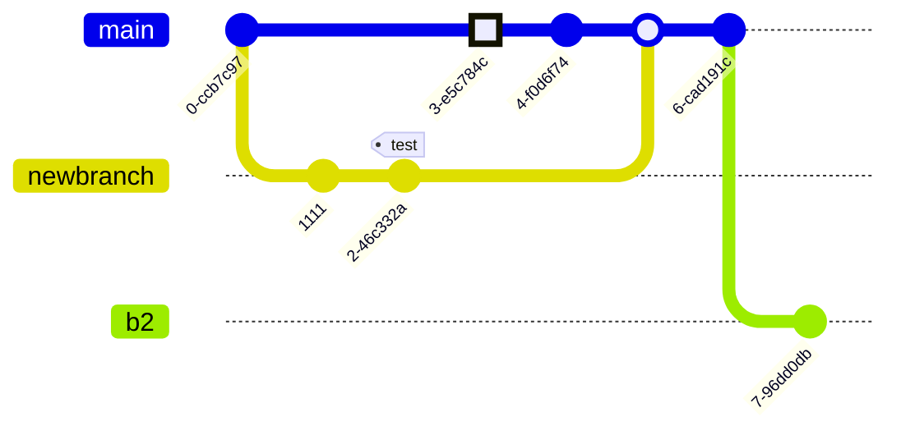
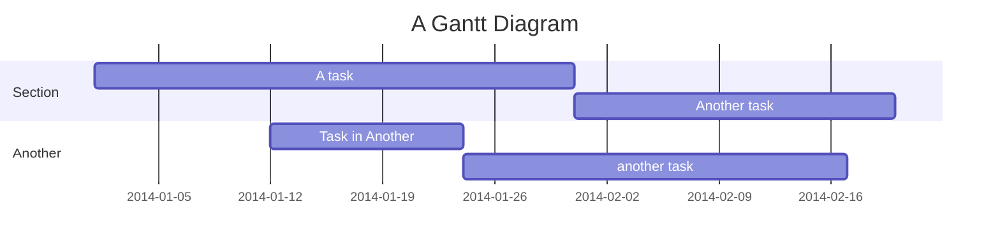

## A flow chart with title

```mermaid
---
title: Job status flow
---
stateDiagram-v2
    direction LR
    [*] --> PENDING
    PENDING --> RUNNING
    RUNNING --> DONE
    DONE --> [*]

    PENDING --> ERROR
    RUNNING --> ERROR
    ERROR --> [*]
    PENDING --> CANCELED


    CANCELED --> [*]
```

## A Gitgraph

```mermaid
gitGraph:
    commit "Ashish"
    branch newbranch
    checkout newbranch
    commit id:"1111"
    commit tag:"test"
    checkout main
    commit type: HIGHLIGHT
    commit
    merge newbranch
    commit
    branch b2
    commit
```

## A Gantt diagram

```mermaid
gantt
    title A Gantt Diagram
    dateFormat YYYY-MM-DD
    section Section
        A task          :a1, 2014-01-01, 30d
        Another task    :after a1, 20d
    section Another
        Task in Another :2014-01-12, 12d
        another task    :24d
```
